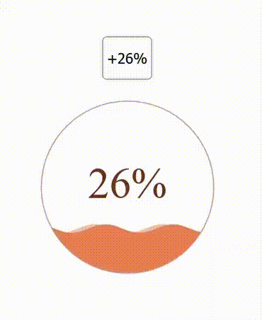

##### 开始使用canvas

* [MDN教程](https://developer.mozilla.org/zh-CN/docs/Web/API/Canvas_API/Tutorial/Basic_usage) 

##### 球形水波进度条

 

代码

* [1-water_wave_ball](./1-water_wave_ball) 

注意事项

1. ctx.clip的性能问题